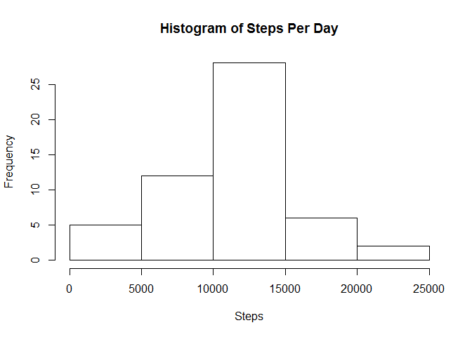
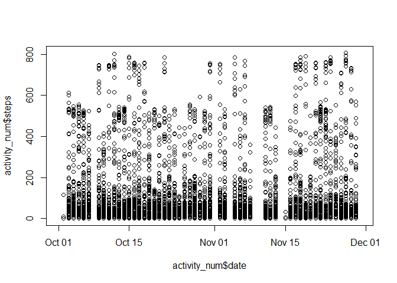
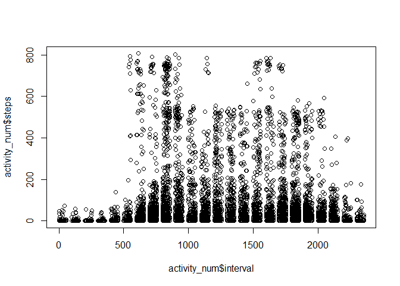
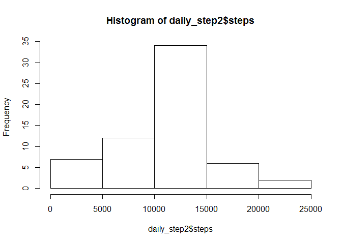
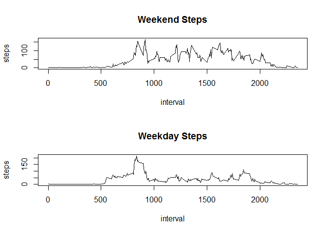

## Loading and preprocessing the data

First we load the libraries that we will be using for this analysis


```r
library(dplyr)
library(readr)
library(lubridate)
```

```
## Warning: package 'lubridate' was built under R version 3.4.3
```

Then we load the data


```r
activity <- read_csv("activity.csv",col_types = cols(date = col_character(),steps = col_character()))
```


## What is mean total number of steps taken per day?
There are a few steps needed to shape the data before calculating these figures:

* Filter out all other variables besides steps and date
* Remove rows with N/A values (R would do it automatically but its cleaner this way)
* Convert the 'steps' variable to numeric
* Aggregate the data by summing all steps records for each day

We will do this with a single new data frame, ```daily_steps``` for simplicity.


```r
daily_steps <- activity %>% dplyr::select(steps,date)
daily_steps <- subset(daily_steps,!is.na(daily_steps$steps))
daily_steps$steps <- as.numeric(daily_steps$steps)
daily_steps <- aggregate(data=daily_steps,FUN=sum,. ~date)
```

Next, we will create a histogram of the total number of steps taken per day


```r
hist(daily_steps$steps,xlab="Steps",main="Histogram of Steps Per Day")
```

<!-- -->

And finally, we will calculate the mean and median of steps taken per day


```r
mean(daily_steps$steps)
```

```
## [1] 10766.19
```

```r
median(daily_steps$steps)
```

```
## [1] 10765
```

## What is the average daily activity pattern?

We will take similar steps as we used above to aggregate the data by 5-minute interval

* Filter out all other variables besides steps and interval
* Remove rows with N/A values (R would do it automatically but its cleaner this way)
* Convert the 'steps' variable to numeric
* Aggregate the data by averaging all steps records for each 5-minute interval


```r
activity_pattern <- activity %>% dplyr::select(steps,interval)
activity_pattern <- subset(activity_pattern,!is.na(activity_pattern$steps))
activity_pattern$steps <- as.numeric(activity_pattern$steps)
activity_pattern <- aggregate(data=activity_pattern,FUN=mean,. ~interval)
```

Now, we plot the average daily activity pattern


```r
plot(activity_pattern,type="l")
```

<!-- -->

Which 5-minute interval, on average across all the days in the dataset, contains the maximum number of steps?


```r
activity_pattern[which.max(activity_pattern$steps),1]
```

```
## [1] 835
```

## Imputing missing values

We begin with a few pre-processing steps on the data:

* First, we copy the ```activity``` data frame into a new data frame ```activity_num``` so we can make changes without altering our original data
* Next, convert steps to numeric
* Finally, convert date to a date field using the ```lubridate``` package


```r
activity_num <- activity
activity_num$steps <- as.numeric(activity_num$steps)
activity_num$date <- ymd(activity_num$date)
```

We then take some exploratory steps for determining how to impute the missing data.

First, count how many missing step counts there actually are


```r
sum(is.na(activity$steps))
```

```
## [1] 2304
```

Next, plot steps against the two other variables (date and interval) to see what the distributions look like


```r
plot(activity_num$date,activity_num$steps)
```

<!-- -->

```r
plot(activity_num$interval,activity_num$steps)
```

<!-- -->

Create a regression model that predicts the number of steps using the values for date and interval.  Add a variable to the original data frame showing the predicted value.


```r
lm_activity <- with(activity_num,lm(steps~poly(date,15)+poly(interval,15)))
activity_num$isteps <- predict.lm(lm_activity,newdata=activity_num)
```

Zero out any negative values generated by the regression model, and then replace NA values with the imputed values.


```r
activity_num$isteps <- replace(activity_num$isteps,activity_num$isteps<0,0)
activity_num$steps <- replace(activity_num$steps,is.na(activity_num$steps),activity_num$isteps)
```

```
## Warning in x[list] <- values: number of items to replace is not a multiple
## of replacement length
```

Now that we have the new data set, filter out the extraneous variables and then aggregate the data by summing the total number of steps for each day.


```r
daily_step2 <- activity_num %>% dplyr::select(steps,date)
daily_step2 <- aggregate(data=daily_step2,FUN=sum,. ~date)
```

Create a histogram of the total number of steps per day (with the imputed data) and determine the mean and median values.


```r
hist(daily_step2$steps)
```

<!-- -->

```r
mean(daily_step2$steps)
```

```
## [1] 10647.35
```

```r
median(daily_step2$steps)
```

```
## [1] 11015
```

## Are there differences in activity patterns between weekdays and weekends?

Use the ```weekdays``` function to create a new column indicating which day of the week each date falls on


```r
activity_num$weekday <- weekdays(activity_num$date)
```

Convert the new value for day of the week into either ```weekday``` or ```weekend```


```r
activity_num$weekday <- replace(activity_num$weekday,activity_num$weekday%in%c("Saturday","Sunday"),"weekend")
activity_num$weekday <- replace(activity_num$weekday,activity_num$weekday%in%c("Monday","Tuesday","Wednesday","Thursday","Friday"),"weekday")
```

Filter out extraneous variables and collapse the data set so that the mean number of steps for each day is aggregated by 5-minute interval and whether its a weekday or weekend.


```r
activity_week <- activity_num %>% dplyr::select(steps,interval,weekday)
activity_week <- aggregate(data=activity_week,FUN=mean,. ~interval+weekday)
```

Create a 1x2 panel with line charts showing the average number of steps by 5-minute interval for weekends and weekdays.


```r
par(mfrow=c(2,1))
with(activity_week[activity_week$weekday=="weekend",],plot(interval,steps,type="l",main="Weekend Steps"))
with(activity_week[activity_week$weekday=="weekday",],plot(interval,steps,type="l",main="Weekday Steps"))
```

<!-- -->
